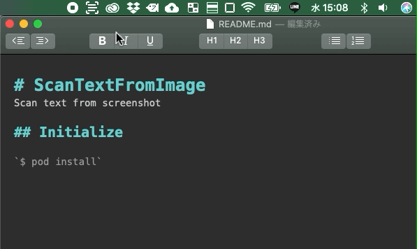

# TextScanner

Scan text from screenshot.

## Installation

TextScanner works on macOS 15.0 or later.

1. Download `Installer.dmg` from [releases](https://github.com/Kyome22/TextScanner/releases) page.
2. Double-click on the `Installer.dmg`.
3. Copy the App to the Applications folder.
